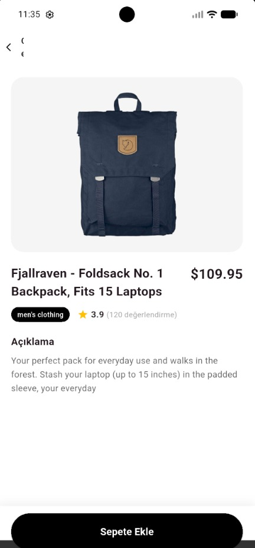
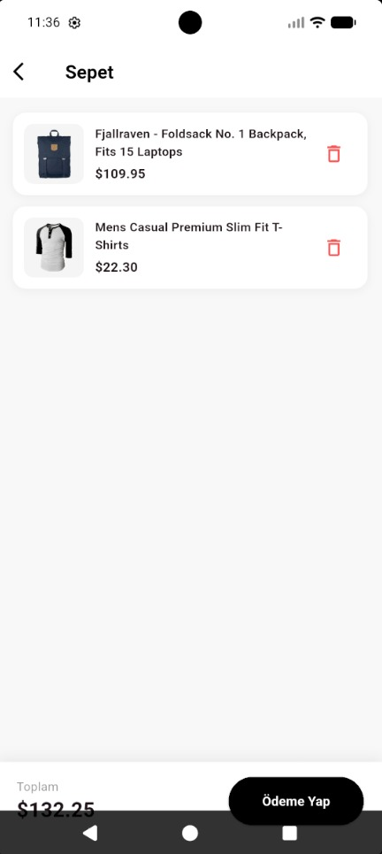

# Mini Katalog Uygulaması

Basit bir Flutter ürün kataloğu uygulaması.

## Özellikler
- FakeStoreAPI'den ürün listeleme
- Ürün arama ve filtreleme
- Ürün detay sayfası
- Sepet yönetimi

## Kullanılan Flutter Sürümü
Flutter 3.x (stable)

## Çalıştırma Adımları
```bash
git clone <repo-url>
cd mini_katalog
flutter pub get
flutter run
```

## Ekran Görüntüleri

<p float="left">
  
  
  
</p>
